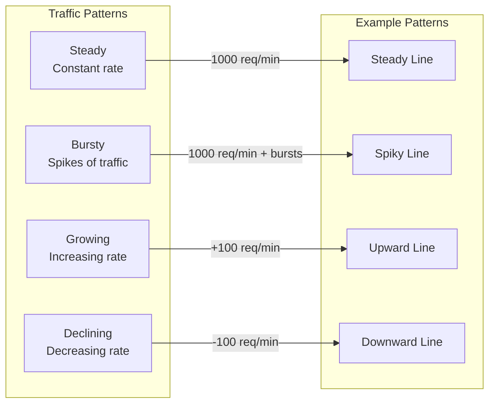
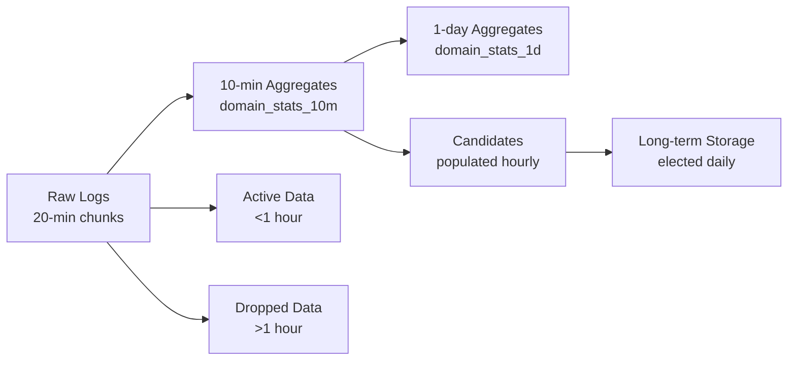

# WebTop

A containerized solution for analyzing website data using TimescaleDB.

## Overview

This project uses TimescaleDB to:
- Record and analyze domain access patterns
- Track the most popular websites over time
- Provide insights via a real-time dashboard
- Test and monitor different traffic patterns
- Simulate AI domain traffic patterns (OpenAI, Claude, Anthropic, Perplexity)

## Quick Start

### Prerequisites
- Docker and Docker Compose
- Git (for cloning the repository)

### Installation & Usage

```bash
# Clone the repository
git clone https://github.com/timescale/template.git
cd template/webtop

# Start services
./webtop.sh start

# View the monitoring dashboard
./webtop.sh monitor

# Stop services
./webtop.sh stop
```

## WebTop Script Commands

The `webtop.sh` script provides the following commands:

| Command | Description |
|---------|-------------|
| `start` | Start the monitoring services and run the main database setup |
| `stop` | Stop the monitoring services |
| `restart` | Restart the monitoring services and reapply the database setup |
| `monitor` | Show unified monitoring dashboard |
| `setup` | Set up traffic patterns for testing |
| `setup-db` | Run the main database setup script without restarting services |
| `reset` | Reset the database (clear all data and remove all traffic generation jobs) |
| `help` | Show help message |

### Job Management and Cleanup

The system includes a job management system that:

1. **Centralized Job Cleanup**: 
   - All job cleanup is handled by a single `cleanup_all_jobs()` function
   - Located in `reset.sql` to ensure availability during resets
   - Targets specific job types: data generation, candidate population, and elections
   - **Note**: The `reset` command will remove all traffic generation jobs, including AI domain patterns

2. **Reset Process**:
   - Safely stops all running jobs
   - Cleans up job history
   - Reinitializes only necessary background jobs
   - Preserves system configuration while clearing data

3. **Job Types**:
   - **Data Generation Jobs**: Generate synthetic traffic for testing
   - **Candidate Population Jobs**: Identify potential top websites
   - **Election Jobs**: Select and track top websites over time

4. **Scheduling Flow**:
   ```mermaid
   graph TD
     A[Reset Command] --> B[cleanup_all_jobs]
     B --> C[Clear Data]
     C --> D[Reset Aggregates]
     D --> E[Schedule Core Jobs]
     E --> F[Verify Job Status]
   ```

### AI Domain Traffic Patterns

The system includes predefined traffic patterns for popular AI domains in `sql/setup/ai-domains.sql`:

1. **OpenAI (openai.com)**:
   - Steady high traffic: 300-500 hits every 5 seconds
   - Simulates consistent high-volume API usage

2. **Claude (claude.ai)**:
   - Bursty traffic: 800-1000 hits every 30 seconds
   - Simulates periodic high-volume requests

3. **Anthropic (anthropic.com)**:
   - Growing traffic: Starts with 100 hits, increases by 50 every minute
   - Simulates increasing adoption over time

4. **Perplexity (perplexity.ai)**:
   - Declining traffic: Starts with 500 hits, decreases by 20 every minute
   - Simulates decreasing usage patterns

To apply these patterns:
```bash
# After starting the services
docker exec -it timescaledb psql -U postgres -d website_tracker -f /sql/setup/ai-domains.sql
```

Monitor the patterns using:
```sql
SELECT * FROM monitor_traffic_patterns();
```

### Database Setup Integration

The `webtop.sh` script now automatically runs the `main.sql` setup script when starting services. This ensures that:

1. **Complete Database Initialization**: All necessary tables, views, and functions are created
2. **Initial Test Data**: Sample data is generated for popular websites
3. **Job Scheduling**: All required background jobs are scheduled with appropriate intervals
4. **Election Process**: The website election process is configured and started

You can also run just the database setup without restarting services using the new `setup-db` command:

```bash
$ ./webtop.sh setup-db
Running main database setup script...
Main setup script completed successfully!
Use ./webtop.sh monitor to see real-time statistics
```

This is useful when you want to reapply the database setup without disrupting running services.

## Interactive Learning Guide

Follow this guide to learn about the system step by step. Each section includes example outputs in collapsible details.

### 1. Starting the System

<details>
<summary>Use `./webtop.sh start` to start the services and check their status</summary>

```bash
$ ./webtop.sh start
Starting WebTop services...
Note: This requires Docker privileges
Services started successfully!
Waiting for database to be ready...
Running main setup script...
Running main pipeline script...
Loading data generation functions...
Generating initial test data...
Starting data generation jobs...
Starting election process jobs...
Setup complete. Checking final state...
Main setup script completed successfully!
Use ./webtop.sh monitor to see real-time statistics

$ docker ps
CONTAINER ID   IMAGE                        COMMAND                  STATUS              PORTS
6e0dd208283d  timescale/timescaledb-ha:pg17 "/docker-entrypoint.…"  Up 23 seconds      0.0.0.0:5432->5432/tcp
```
</details>

### 2. Setting Up Traffic Patterns

<details>
<summary>Configure and start traffic pattern generation</summary>

```bash
$ ./webtop.sh setup
Setting up traffic patterns for testing...
Running traffic patterns setup script...
NOTICE:  Scheduled bursty traffic pattern with job_id=1102
NOTICE:  Current traffic patterns:
NOTICE:  Job ID: 1102, Interval: 00:01:00, Config: {
  "amount": 1000,
  "domain": "bursty-traffic.com",
  "growth_rate": 0,
  "burst_multiplier": 10,
  "burst_probability": 0.4,
  "use_specific_domain": true
}
Traffic patterns set up successfully!
```
</details>

### 3. Monitoring Traffic Patterns

<details>
<summary>View traffic pattern analysis</summary>

```sql
-- Analyze burst patterns over time
SELECT time_bucket('1 minute', time) as minute,
       domain,
       COUNT(*) as requests,
       CASE WHEN COUNT(*) > 1000 THEN 'BURST' ELSE 'NORMAL' END as traffic_state
FROM logs
WHERE domain = 'bursty-traffic.com'
GROUP BY 1, 2
ORDER BY 1 DESC
LIMIT 10;

         minute         |       domain       | requests | traffic_state 
------------------------+--------------------+----------+---------------
 2025-04-28 22:13:00+00 | bursty-traffic.com |      541 | NORMAL
 2025-04-28 22:12:00+00 | bursty-traffic.com |     1381 | BURST
 2025-04-28 22:11:00+00 | bursty-traffic.com |     4336 | BURST
 2025-04-28 22:10:00+00 | bursty-traffic.com |    10032 | BURST
 2025-04-28 22:09:00+00 | bursty-traffic.com |     7009 | BURST
 2025-04-28 22:08:00+00 | bursty-traffic.com |     1016 | BURST
 2025-04-28 22:07:00+00 | bursty-traffic.com |     1000 | NORMAL
 2025-04-28 22:06:00+00 | bursty-traffic.com |     3888 | BURST
 2025-04-28 22:05:00+00 | bursty-traffic.com |     7143 | BURST
 2025-04-28 22:04:00+00 | bursty-traffic.com |      972 | NORMAL
```

This output shows:
- Normal traffic around 1000 requests/minute
- Bursts ranging from ~1300 to ~10000 requests/minute
- Clear distinction between normal and burst states
- Approximately 40% of minutes show burst activity
</details>

### 4. System Configuration

<details>
<summary>View current system configuration</summary>

```sql
-- View active jobs and their configurations
SELECT job_id, proc_name, schedule_interval, config
FROM timescaledb_information.jobs
WHERE proc_name IN ('policy_retention', 'generate_log_data_job')
ORDER BY job_id;

 job_id |       proc_name       | schedule_interval |                                  config                                  
--------+----------------------+------------------+--------------------------------------------------------------------------
   1068 | policy_retention      | 00:01:00         | {"drop_after": "00:30:00", "hypertable_id": 4}
   1102 | generate_log_data_job | 00:01:00         | {"amount": 1000, "domain": "bursty-traffic.com", "growth_rate": 0,
                                                     "burst_multiplier": 10, "burst_probability": 0.4,
                                                     "use_specific_domain": true}
```

Key configurations:
- Data retention: 30 minutes
- Traffic generation: Every minute
- Base traffic: 1000 requests/minute
- Burst probability: 40%
- Burst multiplier: 10x
</details>

### 5. Understanding Traffic Patterns

The system supports different types of traffic patterns to simulate real-world scenarios:



#### What is Bursty Traffic?
Bursty traffic refers to a pattern where traffic levels suddenly spike above the normal baseline. This is common in real-world scenarios such as:
- Breaking news causing sudden website traffic increases
- Social media posts going viral
- Scheduled events (e.g., product launches, ticket sales)
- Flash sales or promotions

The bursty pattern in our system is characterized by:
- **Base Traffic**: Normal, steady traffic level (e.g., 1000 requests/minute)
- **Burst Probability**: Chance of a burst occurring (e.g., 40% chance every minute)
- **Burst Multiplier**: How much traffic increases during a burst (e.g., 10x normal traffic)

### 6. Analyzing Traffic Patterns

<details>
<summary>View detailed traffic analysis</summary>

```sql
-- Analyze burst patterns
SELECT 
    time_bucket('1 minute', timestamp) as minute,
    domain,
    COUNT(*) as requests,
    CASE 
        WHEN COUNT(*) > 1000 THEN 'BURST'
        ELSE 'NORMAL'
    END as traffic_state
FROM logs
WHERE domain = 'bursty-traffic.com'
GROUP BY 1, 2
ORDER BY 1 DESC
LIMIT 10;

 minute           | domain            | requests | traffic_state 
-----------------+-------------------+----------+---------------
 2024-03-20 10:15| bursty-traffic.com| 36621    | BURST
 2024-03-20 10:14| bursty-traffic.com| 1000     | NORMAL
 2024-03-20 10:13| bursty-traffic.com| 1000     | NORMAL
 2024-03-20 10:12| bursty-traffic.com| 10000    | BURST
 2024-03-20 10:11| bursty-traffic.com| 1000     | NORMAL
```
</details>

### 7. Configuration Options

<details>
<summary>View and modify system configuration</summary>

```sql
-- View current retention policy
SELECT * FROM timescaledb_information.jobs 
WHERE proc_name = 'policy_retention';

-- Modify retention period
SELECT add_retention_policy('logs', INTERVAL '2 hours');

-- Adjust chunk interval
SELECT set_chunk_time_interval('logs', INTERVAL '30 minutes');
```
</details>

## Architectural Advantages

### Data Retention and Management
- **Automatic Data Retention**: The system automatically drops logs older than 1 hour, keeping the database size manageable
- **Chunk Time Intervals**: Data is partitioned into 20-minute chunks for efficient querying and management
- **Continuous Aggregates**: Pre-computed aggregations improve query performance for historical analysis

### Scalability Features
- **Hypertable Partitioning**: Data is automatically partitioned by time, allowing for efficient querying of recent data
- **Auto-Tuning Configurations**: The system automatically adjusts to changing traffic patterns
- **Responsive Election Process**: Considers both total and recent traffic for accurate rankings

### Monitoring Capabilities
- **Real-Time Traffic Analysis**: Monitor traffic levels (High, Medium, Low) and trends (Growing, Declining, Stable)
- **Burst Detection**: Identify and analyze traffic bursts with configurable probability and magnitude
- **Historical Comparisons**: Compare current traffic with historical patterns

## Advanced Features

### Continuous Aggregates

The system uses continuous aggregates to efficiently analyze traffic patterns at different time scales:

<details>
<summary>View continuous aggregate configurations</summary>

```sql
-- View all continuous aggregates
SELECT 
    hypertable_schema,
    hypertable_name,
    view_schema,
    view_name,
    view_definition,
    refresh_policy
FROM timescaledb_information.continuous_aggregates;

-- Example output:
 hypertable_schema | hypertable_name | view_schema | view_name | refresh_policy
------------------+-----------------+-------------+-----------+---------------
 public           | logs           | public      | traffic_patterns_monitor | {"start_offset": "1 hour", "end_offset": "1 minute", "schedule_interval": "1 minute"}

-- View refresh policy details
SELECT 
    view_name,
    schedule_interval,
    start_offset,
    end_offset,
    next_start
FROM timescaledb_information.jobs
WHERE proc_name = 'policy_refresh_continuous_aggregate';
```

The continuous aggregates are configured with:
- **Refresh Schedule**: Every minute
- **Lookback Window**: 1 hour
- **Data Retention**: 30 minutes
- **Hierarchical Aggregation**: 
  1. Raw logs → 1-minute aggregates
  2. 1-minute aggregates → 5-minute aggregates
  3. 5-minute aggregates → hourly aggregates
</details>

### Hypertable Partitioning

The system uses TimescaleDB's hypertable partitioning for efficient data management:

<details>
<summary>View hypertable configuration</summary>

```sql
-- View hypertable information
SELECT 
    hypertable_schema,
    hypertable_name,
    compression_enabled,
    compression_segmentby,
    compression_orderby,
    chunk_time_interval
FROM timescaledb_information.hypertables;

-- Example output:
 hypertable_schema | hypertable_name | compression_enabled | chunk_time_interval
------------------+-----------------+--------------------+--------------------
 public           | logs           | true               | 20 minutes

-- View chunk information
SELECT 
    chunk_name,
    range_start,
    range_end,
    is_compressed,
    compression_status
FROM timescaledb_information.chunks
WHERE hypertable_name = 'logs'
ORDER BY range_start DESC
LIMIT 5;

-- Example output:
     chunk_name     |      range_start      |       range_end       | is_compressed | compression_status
--------------------+----------------------+----------------------+---------------+------------------
 _hyper_1_1_chunk  | 2024-03-20 10:00:00  | 2024-03-20 10:20:00  | true          | Compressed
 _hyper_1_2_chunk  | 2024-03-20 10:20:00  | 2024-03-20 10:40:00  | false         | Uncompressed
 _hyper_1_3_chunk  | 2024-03-20 10:40:00  | 2024-03-20 11:00:00  | false         | Uncompressed
```

Key partitioning features:
1. **Chunk Time Interval**: 20 minutes
2. **Compression**:
   - Enabled after 1 hour
   - Segment by: domain
   - Order by: time DESC
3. **Retention Policy**: 
   - Drops chunks older than 1 hour
   - Automatically removes compressed chunks
</details>

### Hierarchical Data Flow



The data flow follows these key stages:

1. **Raw Data Collection**:
   - Logs are stored in 20-minute chunks
   - Real-time ingestion of domain access data
   - Automatic chunk creation and management

2. **Continuous Aggregation**:
   - **10-minute Aggregates** (`domain_stats_10m`):
     - Refreshes every 5 minutes
     - Keeps last 7 days of data
     - Base level for detailed analysis
   - **1-day Aggregates** (`domain_stats_1d`):
     - Refreshes every hour
     - Keeps last 90 days of data
     - Used for long-term trends

3. **Candidate Processing**:
   - **Hourly Population**:
     - Identifies domains meeting minimum hit threshold
     - Uses appropriate aggregation level based on election window
     - Maintains candidate list for 7 days
   - **Daily Election**:
     - Elects top websites based on weighted scoring
     - Updates long-term storage
     - Maintains historical rankings

4. **Data Lifecycle**:
   - **Active Data** (<1 hour):
     - Real-time querying
     - Immediate aggregation
   - **Retention** (>1 hour):
     - Automatic chunk dropping via retention policy
     - Maintains system performance
     - Preserves storage efficiency

### Performance Optimization

<details>
<summary>View performance tuning configurations</summary>

```sql
-- View compression settings
SELECT 
    hypertable_name,
    compression_segmentby,
    compression_orderby,
    compression_chunk_size
FROM timescaledb_information.compression_settings;

-- Example output:
 hypertable_name | compression_segmentby | compression_orderby | compression_chunk_size
----------------+----------------------+-------------------+---------------------
 logs           | {domain}             | {time DESC}       | 1000000

-- View job statistics
SELECT 
    application_name,
    schedule_interval,
    next_start,
    total_runs,
    total_successes,
    total_failures,
    last_run_started_at,
    last_successful_finish
FROM timescaledb_information.job_stats
WHERE proc_name IN (
    'policy_retention',
    'policy_compression',
    'policy_refresh_continuous_aggregate'
);
```

Performance features:
1. **Query Optimization**:
   - Parallel query execution
   - Index-only scans for aggregates
   - Materialized views for common queries
2. **Resource Management**:
   - Automatic chunk compression
   - Background job scheduling
   - Memory-aware query planning
3. **Monitoring**:
   - Job success rates
   - Compression ratios
   - Query performance metrics
</details>

## Troubleshooting

### Common Issues and Solutions

#### 1. Database Connection Issues

**Problem**: The `webtop.sh start` command fails with connection errors.

**Solution**:
```bash
# Check if Docker is running
docker ps

# If Docker is not running, start it
# On macOS: Open Docker Desktop
# On Linux: sudo systemctl start docker

# If the container is running but not healthy, restart it
docker compose down
docker compose up -d
```

#### 2. No Data in the Monitoring Dashboard

**Problem**: The monitoring dashboard shows no traffic data.

**Solution**:
```bash
# Check if data generation jobs are running
./webtop.sh setup-db

# Verify job status
docker exec -it timescaledb psql -U postgres -c "SELECT job_id, proc_name, schedule_interval FROM timescaledb_information.jobs WHERE proc_name LIKE 'generate_log_data_job%';"

# If jobs are not running, restart the system
./webtop.sh restart
```

#### 3. Slow Dashboard Performance

**Problem**: The monitoring dashboard is slow to update or respond.

**Solution**:
```bash
# Check database performance
docker exec -it timescaledb psql -U postgres -c "SELECT * FROM timescaledb_information.job_stats WHERE proc_name IN ('policy_refresh_continuous_aggregate');"

# Adjust continuous aggregate refresh policy if needed
docker exec -it timescaledb psql -U postgres -c "SELECT alter_job(1234, schedule_interval => '5 minutes');"  # Replace 1234 with actual job_id
```

#### 4. Missing Top Websites in Election Results

**Problem**: The top websites report is empty or not updating.

**Solution**:
```bash
# Check if election jobs are running
docker exec -it timescaledb psql -U postgres -c "SELECT job_id, proc_name, schedule_interval FROM timescaledb_information.jobs WHERE proc_name LIKE 'populate_website_candidates_job%';"

# If jobs are not running, restart the election process
docker exec -it timescaledb psql -U postgres -c "SELECT schedule_website_tracking_jobs();"
```

### Debugging Tips

1. **Check Docker Logs**:
   ```bash
   docker logs timescaledb
   ```

2. **Connect to Database Directly**:
   ```bash
   docker exec -it timescaledb psql -U postgres
   ```

3. **Verify Database Schema**:
   ```sql
   -- Check if tables exist
   \dt
   
   -- Check if functions exist
   \df
   ```

4. **Reset the System**:
   If all else fails, you can reset the entire system:
   ```bash
   ./webtop.sh reset
   ./webtop.sh start
   ```

## Extending the System

### Adding Custom Traffic Patterns

You can add custom traffic patterns by modifying the `data-generation.sql` file:

1. Define a new function for your traffic pattern
2. Add a job scheduling call in the `setup_traffic_patterns()` function
3. Restart the system to apply changes

### Customizing the Election Process

To modify how top websites are elected:

1. Edit the `election.sql` file
2. Adjust the scoring algorithm in the `elect_top_websites()` function
3. Run `./webtop.sh setup-db` to apply changes

### Adding New Metrics

To add new metrics to the monitoring dashboard:

1. Create a new continuous aggregate in `pipeline.sql`
2. Add a new view in `main.sql`
3. Update the monitoring dashboard query in `webtop.sh`
